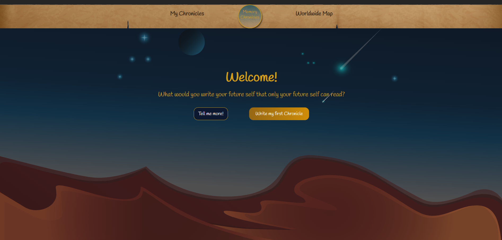

# Memory Chronicles

Memory Chronicles is a full-stack web app for writing **time-locked messages to your future self**.
You compose a "chronicle" — a note with a mood, an optional photo, a voice recording, and a place on
the map — and pick a reveal date. The message stays sealed until that date passes, then it unlocks in
your dashboard. Chronicles marked public also appear, once revealed, on a shared world map so anyone
can browse memories left by others around the globe.

It is built as a Laravel 12 REST API with a React + Vite single-page frontend.

## Preview




## UX Flow

The overall user experience flow across the app's pages (landing page, world map, message board, login/register, user dashboard, and message details) is shown below.


## Features

- **Time-locked capsules** — a chronicle cannot be read until its reveal date; the API returns a locked response until then.
- **Rich attachments** — attach a location pin, an uploaded image, and an audio clip (upload a file or record straight from the browser), with server-side size limits (5 MB images, 10 MB audio).
- **Draft autosave** — signed-in users keep a single running draft that is restored between visits; guests can compose first and are prompted to register before the capsule is stored.
- **Private / public visibility** — private capsules are visible only to their author; public capsules join the shared board once revealed.
- **World map** — revealed public capsules are plotted by location, with their country resolved via reverse-geocoding at save time.
- **Public board with filters** — browse revealed public capsules by mood, country, or date range.
- **Personal dashboard** — see all your capsules and open the ones that have unlocked.
- **Attachment download** — download a single attachment, or a ZIP of every file on a capsule.
- **JWT authentication** — register / login / refresh / logout via `tymon/jwt-auth`.
- **Mood tagging** — each capsule is tagged happy, sad, or neutral.

## Repository Structure

- `backend/` Laravel 12 API and business logic
- `frontend/` React application built with Vite

## Prerequisites

- PHP 8.2–8.4 with the `openssl`, `pdo_sqlite` (or `pdo_mysql`), `mbstring`, `curl`, `fileinfo`, `intl`, `gd`, and `zip` extensions
- Composer 2
- Node.js 18+ and npm
- A database — SQLite works out of the box (below); MySQL is also supported via `backend/.env`

## Initial Setup

### 1) Backend setup

```powershell
cd backend
composer install

# Create the env file, then generate the app + JWT keys
Copy-Item .env.example .env
php artisan key:generate
php artisan jwt:secret

# SQLite (simplest): create the database file, then in backend/.env set
#   DB_CONNECTION=sqlite
#   AUTH_GUARD=api
New-Item -ItemType File database\database.sqlite

php artisan migrate
php artisan db:seed   # optional: sample users and public capsules
```

To use MySQL instead, keep the `DB_*` values in `.env` (`DB_CONNECTION=mysql`, `DB_DATABASE=memory_db`, …) and skip the SQLite steps.

### 2) Frontend setup

```powershell
cd ../frontend
npm install
```

The frontend reads the API base URL from `frontend/.env`:

```
VITE_API_URL=http://127.0.0.1:8000/api/v1
```

CORS for `http://localhost:5173` and `http://127.0.0.1:5173` is already configured in `backend/config/cors.php`.

## Run the App (Development)

Use two terminals from the repository root.

### Terminal A: Backend API

```powershell
cd backend
php artisan serve
```

The API is available at `http://127.0.0.1:8000` (routes under `/api/v1`).

### Terminal B: Frontend

```powershell
cd frontend
npm run dev
```

The frontend is available at `http://localhost:5173`.

## API Overview

Base path: `/api/v1`

| Method | Endpoint | Auth | Purpose |
| --- | --- | --- | --- |
| POST | `auth/register` | – | Create an account, returns a JWT |
| POST | `auth/login` | – | Log in, returns a JWT |
| POST | `auth/logout` | bearer | Invalidate the current token |
| POST | `auth/refresh` | bearer | Rotate the token |
| GET | `auth/me` | bearer | Current user |
| GET | `capsules/public` | – | Revealed public capsules (`mood`, `country`, `date_from`, `date_to` filters) |
| GET | `capsules` | bearer | The user's capsules |
| GET | `capsules/{id}` | bearer | A single capsule (locked until its reveal date) |
| POST | `create_capsules` | bearer | Finalize and seal a capsule |
| GET | `capsules/draft` | bearer | The user's current draft |
| POST | `capsules/draft` | bearer | Create or update the draft |
| GET | `attachments/{id}/download` | bearer | Download one attachment |
| GET | `capsules/{id}/attachments/zip` | bearer | Download all attachments as a ZIP |

## Helpful Commands

### Backend

```powershell
cd backend
php artisan test
php artisan migrate:fresh --seed   # rebuild the database
```

### Frontend

```powershell
cd frontend
npm run build
npm run preview
npm run lint
```

## Notes

- Keep the frontend `VITE_API_URL` and the backend `APP_URL` / CORS origins aligned.
- There are framework-specific READMEs in `backend/README.md` and `frontend/README.md`.
