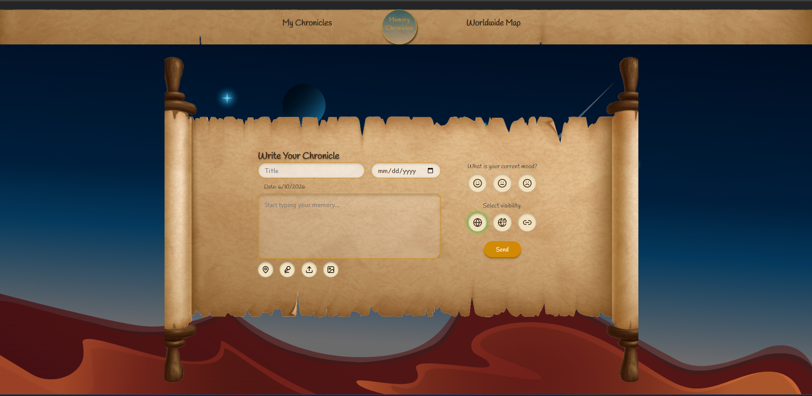
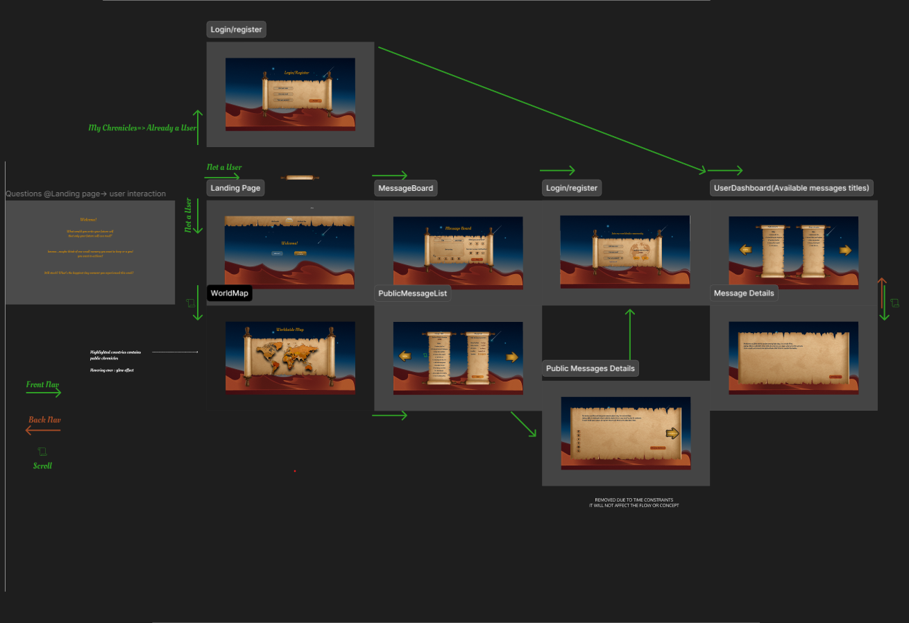

# Memory Chronicles

Memory Chronicles is a full-stack web application with a Laravel API backend and a React + Vite frontend.

## Preview



## UX Flow

The overall user experience flow across the app's pages (landing page, world map, message board, login/register, user dashboard, and message details) is shown below.



## Repository Structure

- `backend/` Laravel 12 API and business logic
- `frontend/` React application built with Vite

## Prerequisites

- PHP 8.2+
- Composer
- Node.js 18+ and npm
- A database configured for Laravel (`backend/.env`)

## Initial Setup

### 1) Backend setup

```powershell
cd backend
composer install
php artisan key:generate
php artisan migrate
```

If `backend/.env` does not exist, create it from `.env.example` first.

### 2) Frontend setup

```powershell
cd ../frontend
npm install
```

## Run the App (Development)

Use two terminals from the repository root.

### Terminal A: Backend API

```powershell
cd backend
php artisan serve
```

The API is usually available at `http://127.0.0.1:8000`.

### Terminal B: Frontend

```powershell
cd frontend
npm run dev
```

The frontend is usually available at `http://localhost:5173`.

## App View While Running

This is the Message Board view you should see once the frontend and backend are running.


## Helpful Commands

### Backend

```powershell
cd backend
php artisan test
```

### Frontend

```powershell
cd frontend
npm run build
npm run preview
```

## Notes

- If you use API authentication locally, ensure CORS and API base URL settings are aligned between frontend and backend.
- There are existing module-level READMEs in `backend/README.md` and `frontend/README.md` for framework-specific details.
